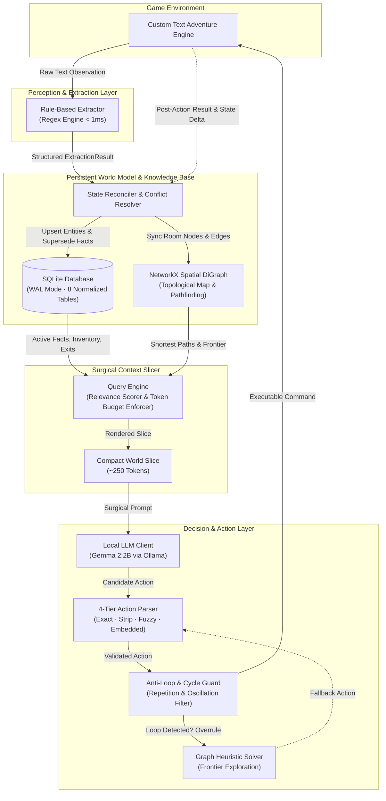

# 🌌 ENVORA — Environment-aware Reasoning Agent

<div align="center">

[](https://www.python.org/)
[](https://www.sqlite.org/)
[](https://networkx.org/)
[](https://ollama.ai/)
[](https://docs.pydantic.dev/)
[](https://docs.pytest.org/)
[](LICENSE)

<p align="center">
  <strong>Autonomous Neuro-Symbolic Agent for Interactive Text Worlds & Complex Puzzle Environments</strong><br>
  Powered by a <em>Persistent Relational World Model</em>, <em>NetworkX Spatial Reasoning</em>, and <em>Surgical Context Slicing</em>.
</p>

</div>

---

## 📖 Table of Contents

- [Executive Overview](#-executive-overview)
- [Why World Model vs. Conversational Memory?](#-why-world-model-vs-conversational-memory)
- [System Architecture](#-system-architecture)
- [Step-by-Step Cognitive Workflow](#-step-by-step-cognitive-workflow)
- [Relational Knowledge Base & ER Schema](#-relational-knowledge-base--er-schema)
- [Core Engineering Pillars](#-core-engineering-pillars)
  - [1. Sub-Millisecond Perception Engine](#1-sub-millisecond-perception-engine)
  - [2. Self-Correcting World State Reconciler](#2-self-correcting-world-state-reconciler)
  - [3. Graph-Theoretic Spatial Exploration (NetworkX)](#3-graph-theoretic-spatial-exploration-networkx)
  - [4. Surgical World Slice Query Engine](#4-surgical-world-slice-query-engine)
  - [5. Dual-Engine Decision Making (Local LLM + Heuristic Solver)](#5-dual-engine-decision-making-local-llm--heuristic-solver)
  - [6. Multi-Tier Anti-Loop & Oscillation Detection](#6-multi-tier-anti-loop--oscillation-detection)
- [Project Directory Structure](#-project-directory-structure)
- [Quick Start & Installation](#-quick-start--installation)
  - [Prerequisites](#prerequisites)
  - [Installation Steps](#installation-steps)
  - [Local LLM Setup (Ollama)](#local-llm-setup-ollama)
- [How to Run the Agent](#-how-to-run-the-agent)
  - [1. Standard AI Mode with Local LLM](#1-standard-ai-mode-with-local-llm)
  - [2. Zero-LLM / Offline Heuristic Mode](#2-zero-llm--offline-heuristic-mode)
  - [3. Persistent Session with SQLite Storage](#3-persistent-session-with-sqlite-storage)
  - [4. Custom Step Limits & Worlds](#4-custom-step-limits--worlds)
- [CLI Reference & Configuration](#-cli-reference--configuration)
  - [CLI Flags](#cli-flags)
  - [Environment Variables](#environment-variables)
- [Sample World: The Enchanted Manor](#-sample-world-the-enchanted-manor)
- [Authoring Custom Worlds](#-authoring-custom-worlds)
- [Testing & Quality Assurance](#-testing--quality-assurance)
- [SOLID Architecture & Design Principles](#-solid-architecture--design-principles)
- [License](#-license)

---

## 🌟 Executive Overview

Traditional LLM game-playing agents suffer from **context window exhaustion**, **hallucinatory drift**, and **crippling token latency** caused by dumping raw conversational history into prompts. As turns increase, memory consumption scales linearly ($O(N)$), conflicting historical observations accumulate silently, and token costs explode.

**ENVORA** (**ENV**ironment-aware Reas**O**ning **A**gent) solves this fundamental challenge through a **Neuro-Symbolic Architecture**. Rather than relying on conversational transcripts, the agent maintains a **live, queryable relational world model** (SQLite + NetworkX graph).

At every step, ENVORA:
1. **Extracts** structured facts from raw text in `<1ms`.
2. **Reconciles** observations with a normalized relational database.
3. **Slices** the world model into an ultra-compact **~250 token context** containing only the immediate spatial surroundings, relevant facts, active inventory, and anti-loop failure memories.
4. **Decides** the optimal action using either a quantized local LLM (`Gemma 2:2B` via Ollama) or a graph-theoretic heuristic fallback.
5. **Prevents loops** through sequence tracking and topological cycle detection.

```
       RAW OBSERVATION                  MINIMAL WORLD SLICE             EXECUTABLE ACTION
┌───────────────────────────┐        ┌───────────────────────┐        ┌───────────────────┐
│ "You are in the Library.  │        │ ROOM: Library         │        │                   │
│  Exits: north, south.     │ ─────► │ EXITS: north, south   │ ─────► │   "take ancient   │
│  You see: ancient book.   │        │ OBJECTS: ancient book │        │    grimoire"      │
│  The cabinet is locked."  │        │ FACTS: key is in desk │        │                   │
└───────────────────────────┘        └───────────────────────┘        └───────────────────┘
```

---

## ⚖️ Why World Model vs. Conversational Memory?

| Capability | Naive Conversational Agent | ENVORA (Relational World Model) |
|---|---|---|
| **Context Length Scaling** | Linear $O(N)$ — overflows context window | **Bounded $O(1)$** — strictly fixed at ~250 tokens |
| **Contradiction Handling** | Stale facts accumulate; LLM hallucinates past states | **Superseding RDF Triples** with active state flags |
| **Queryability** | Unstructured text dump | **Structured SQL + Semantic Relevance Scoring** |
| **Spatial Awareness** | Poor (LLM loses track of topological connections) | **NetworkX Directed Graph** with Dijkstra pathfinding |
| **Step Latency (CPU)** | 10–25s per step (parsing huge prompt contexts) | **~1.5–2s per step** with Ollama on CPU |
| **Offline Resilience** | Completely non-functional without active LLM | **100% playable** via Graph Heuristic Planner |
| **State Persistence** | Lost immediately when the process terminates | **Persisted to disk** via SQLite database file |

---

## 🏗️ System Architecture



---

## 🔄 Step-by-Step Cognitive Workflow

```
 1. ENVIRONMENT EMISSION
    └─ Environment yields text observation, numeric reward, and termination flag.
       │
 2. SUB-MILLISECOND EXTRACTION
    └─ Extractor runs high-throughput regex parsers to structure:
       • Room Name & Description
       • Exit directions (north, south, east, west, up, down)
       • Visible objects & revealed items
       • NPCs & spoken dialogue
       • State changes (taken, dropped, unlocked, opened)
       │
 3. WORLD MODEL RECONCILIATION
    └─ Reconciler ingests ExtractionResult and executes transactional updates:
       • Upserts room registry (updates last_seen, visit_count)
       • Registers newly discovered exits & directional connections
       • Updates spatial NetworkX DiGraph (nodes + directed edges)
       • Resolves fact conflicts (supersedes previous RDF triples)
       • Decays episodic memory relevance (0.95x/step) and prunes stale memory
       │
 4. SURGICAL CONTEXT SLICING
    └─ Query Engine builds a bounded, priority-ranked WorldSlice:
       • Current room and room description
       • Available exits & items present
       • Current inventory contents
       • Context-relevant facts (scored by spatial proximity and recency)
       • Recent failure memories (to prevent repeating invalid actions)
       • Valid action candidates from environment
       • Token counter verifies prompt fits within 250-token budget
       │
 5. ACTION SELECTION & GENERATION
    └─ Action candidate generated:
       • Primary: Ollama streams prompt to Gemma 2:2B with low temperature (0.2).
       • Secondary: If Ollama is offline or generation fails, Graph Heuristic Solver steps in.
       │
 6. FUZZY ACTION PARSING
    └─ ActionParser processes the raw LLM output through 4 defensive layers:
       1. Exact match against valid actions.
       2. Leading prefix strip (e.g., "Action: ", "> ").
       3. SequenceMatcher fuzzy string distance ratio.
       4. Substring embedded command extraction.
       5. Safe default ("look").
       │
 7. ANTI-LOOP & CYCLE DETECTION
    └─ Agent evaluates parsed action against historical rolling window:
       • Action Frequency: Flags actions repeated ≥2 times in the last 6 steps.
       • Room Oscillation: Identifies 2-room ping-pong bouncing.
       • If looping: Overrules LLM with Graph-Guided Frontier Navigation.
       │
 8. ACTION EXECUTION & POST-ACTION AUDIT
    └─ Action dispatched to Environment. State updates (e.g. inventory shift, unlock)
       are recorded into SQLite for the next cycle.
```

---

## 🗄️ Relational Knowledge Base & ER Schema

ENVORA grounds its memory in an **8-table normalized SQLite schema** operating in `WAL` (Write-Ahead Logging) mode with strict foreign key integrity:

```
┌─────────────────────────┐           ┌─────────────────────────┐           ┌─────────────────────────┐
│          rooms          │           │       connections       │           │         objects         │
├─────────────────────────┤           ├─────────────────────────┤           ├─────────────────────────┤
│ id (PK)         INTEGER │◄────┐     │ id (PK)         INTEGER │     ┌────►│ id (PK)         INTEGER │
│ name (UNIQUE)   TEXT    │     │     │ from_room_id    INTEGER ├─────┤     │ name (UNIQUE)   TEXT    │
│ description     TEXT    │     ├────►│ to_room_id      INTEGER │     │     │ description     TEXT    │
│ visited         BOOLEAN │     │     │ direction       TEXT    │     │     │ room_id (FK)    INTEGER ├─►rooms
│ visit_count     INTEGER │     │     │ locked          BOOLEAN │     │     │ portable        BOOLEAN │
│ first_seen      INTEGER │     │     │ lock_key        TEXT    │     │     │ state           TEXT    │
│ last_seen       INTEGER │     │     │ UNIQUE(from, direction) │     │     │ properties      JSON    │
└─────────────────────────┘     │     └─────────────────────────┘     │     └─────────────────────────┘
                                │                                     │
                                │     ┌─────────────────────────┐     │     ┌─────────────────────────┐
                                │     │        inventory        │     │     │          npcs           │
                                │     ├─────────────────────────┤     │     ├─────────────────────────┤
                                │     │ id (PK)         INTEGER │     │     │ id (PK)         INTEGER │
                                │     │ object_id (FK)  INTEGER ├─────┘     │ name (UNIQUE)   TEXT    │
                                │     │ acquired_step   INTEGER │           │ description     TEXT    │
                                │     │ UNIQUE(object_id)       │           │ room_id (FK)    INTEGER ├─►rooms
                                │     └─────────────────────────┘           │ dialogue        TEXT    │
                                │                                           │ state           TEXT    │
                                │     ┌─────────────────────────┐           └─────────────────────────┘
                                │     │       room_states       │
                                │     ├─────────────────────────┤           ┌─────────────────────────┐
                                ├────►│ id (PK)         INTEGER │           │     observed_facts      │
                                │     │ room_id (FK)    INTEGER │           ├─────────────────────────┤
                                │     │ state_key       TEXT    │           │ id (PK)         INTEGER │
                                │     │ state_value     TEXT    │           │ subject         TEXT    │
                                │     │ updated_step    INTEGER │           │ predicate       TEXT    │
                                │     │ UNIQUE(room_id, key)    │           │ object          TEXT    │
                                │     └─────────────────────────┘           │ confidence      REAL    │
                                │                                           │ source_step     INTEGER │
                                │     ┌─────────────────────────┐           │ superseded_by   INTEGER ├─┐(self)
                                │     │      agent_memory       │           │ active          BOOLEAN │ └───┘
                                │     ├─────────────────────────┤           │ UNIQUE(s, p) WHERE act=1│
                                │     │ id (PK)         INTEGER │           └─────────────────────────┘
                                └────►│ memory_type     TEXT    │
                                      │ content         TEXT    │
                                      │ relevance       REAL    │
                                      │ created_step    INTEGER │
                                      │ active          BOOLEAN │
                                      └─────────────────────────┘
```

### Self-Correcting Fact Lifecycle (Superseding Chain)
When the agent discovers new states that contradict existing facts, it **deactivates** the stale record, points its `superseded_by` pointer to the new fact, and inserts the latest truth.
```
Step 02:  FACT #1: ("rusty_chest", "state_is", "locked")   [active = 1, superseded_by = NULL]
Step 08:  ACTION : "unlock rusty_chest with brass_key"
Step 08:  FACT #1: ("rusty_chest", "state_is", "locked")   [active = 0, superseded_by = 2]
          FACT #2: ("rusty_chest", "state_is", "unlocked") [active = 1, superseded_by = NULL]
```
The Query Engine filters with `WHERE active = 1`, ensuring the LLM is **never exposed to stale contradictions**.

---

## ⚡ Core Engineering Pillars

### 1. Sub-Millisecond Perception Engine
Instead of spending 5–10 seconds using an LLM to parse text into JSON, `Extractor` uses pre-compiled regular expression state machines to tokenize room headers, exits, visible items, spoken dialogue, and state transitions in **under 1 millisecond**.

### 2. Self-Correcting World State Reconciler
The `Reconciler` acts as the single entry gatekeeper for world mutations:
- **Automatic Upserts**: Merges room descriptions without data loss when revisiting.
- **Relational Integrity**: Moves objects between `room_id` and `inventory` atomically.
- **Memory Decay**: Multiplies memory relevance by `0.95` per step, pruning entries below `0.1` relevance every 20 steps to prevent database bloat.

### 3. Graph-Theoretic Spatial Exploration (NetworkX)
The agent maintains a live `nx.DiGraph` representing the game's topological map:
- Automatically tracks unexplored room exits (`to_room_id is None`).
- Computes **Dijkstra shortest paths** across multi-room corridors to transport the agent to the nearest unvisited frontier room or return to the start room with quest items.

### 4. Surgical World Slice Query Engine
Small language models (e.g. 2B parameters) degrade rapidly when overwhelmed with irrelevant noise. `QueryEngine` constructs a lean, focused context:
- Ranks facts via multi-factor heuristics (spatial room match, object relevance, recency bonus).
- Progressively trims low-priority facts if token estimation exceeds `world_slice_max_tokens` (default: 250 tokens).

### 5. Dual-Engine Decision Making (Local LLM + Heuristic Solver)
- **Primary Engine**: Quantized `Gemma 2:2B` running locally via Ollama with low temperature (`0.2`), short token budget (`30`), and 4-thread CPU parallelism.
- **Deterministic Heuristic Solver**: An 8-tier hierarchical decision tree that executes if Ollama is unavailable or when the agent detects a repetitive pattern:
  1. Win/Objective item activation.
  2. Door unlocking (if required key is in inventory).
  3. Objective item acquisition.
  4. Unexamined object inspection.
  5. NPC dialogue triggers.
  6. Direct movement to unvisited adjacent rooms.
  7. Dijkstra shortest-path navigation to unexplored frontiers.
  8. Non-repeating directional exploration.

### 6. Multi-Tier Anti-Loop & Oscillation Detection
- **Action Frequency Monitoring**: Tracks rolling action history and intervenes if an action repeats $\ge 2$ times in 6 steps.
- **Room Oscillation Detection**: Analyzes room history windows; if the agent is ping-ponging between $\le 2$ rooms, movement actions are overridden to force exploration of new exits.

---

## 📂 Project Directory Structure

```
TextWorldAgent/
├── main.py                           # CLI entry point with Rich terminal UI
├── requirements.txt                  # Python dependencies (Pydantic, Ollama, NetworkX, Rich)
├── README.md                         # Comprehensive architectural documentation
│
├── app/                              # Core application source code
│   ├── config.py                     # Centralized AppConfig (Pydantic BaseSettings)
│   │
│   ├── models/                       # Domain data models & types
│   │   └── schemas.py                # Pydantic schemas (Room, Fact, WorldSlice, AgentAction)
│   │
│   ├── database/                     # Persistence layer
│   │   ├── schema.sql                # SQLite DDL with 8 normalized tables & indexes
│   │   ├── connection.py             # DatabaseConnection manager (WAL mode)
│   │   └── repository.py             # Repository pattern (CRUD + UPSERT implementations)
│   │
│   ├── environment/                  # Text adventure environment engine
│   │   ├── base.py                   # GameEnvironment abstract protocol
│   │   ├── custom_env.py             # JSON-driven text adventure simulator
│   │   └── worlds/
│   │       └── sample_world.json     # "The Enchanted Manor" 8-room quest world
│   │
│   ├── extractor/                    # Fast perception layer
│   │   └── extractor.py              # Sub-millisecond regex observation parser
│   │
│   ├── world_model/                  # Knowledge base & reconciliation
│   │   ├── world_model.py            # Central coordinator & NetworkX graph manager
│   │   └── reconciler.py             # State reconciliation & conflict resolution engine
│   │
│   ├── query_engine/                 # Context synthesis layer
│   │   └── query_engine.py           # Surgical WorldSlice builder with token budgets
│   │
│   ├── agent/                        # Cognitive agent layer
│   │   ├── agent.py                  # EnvoraAgent orchestrator & heuristic solver
│   │   └── action_parser.py          # 4-tier fuzzy action matcher & sanitizer
│   │
│   ├── llm/                          # Local language model client
│   │   └── llm_client.py             # Ollama client optimized for CPU speed & low latency
│   │
│   └── utils/                        # Utilities
│       └── token_counter.py          # Fast heuristic token estimation
│
└── tests/                            # Comprehensive pytest test suite (20 tests)
    ├── test_action_parser.py         # Fuzzy matching & output cleaning tests
    ├── test_agent.py                 # Multi-step execution & loop detection tests
    ├── test_environment.py           # Custom environment physics & movement tests
    ├── test_extractor.py             # Regex extraction & state-change tests
    ├── test_query_engine.py          # World slice generation & budget tests
    └── test_world_model.py           # Relational updates & inventory transfer tests
```

---

## 🚀 Quick Start & Installation

### Prerequisites

- **Python 3.10+** (Tested on Python 3.10, 3.11, 3.12, 3.14)
- **Git**
- *(Optional for LLM mode)* **[Ollama](https://ollama.com/)** for local offline inference.

### Installation Steps

1. **Clone the repository:**
   ```bash
   git clone https://github.com/BLESSEDSAMUELES/TextWorldAgent.git
   cd TextWorldAgent
   ```

2. **Create and activate a virtual environment:**
   ```bash
   # Linux / macOS
   python3 -m venv venv
   source venv/bin/activate

   # Windows (PowerShell)
   python -m venv venv
   .\venv\Scripts\Activate.ps1
   ```

3. **Install dependencies:**
   ```bash
   pip install -r requirements.txt
   ```

### Local LLM Setup (Ollama)

To run the agent with local LLM intelligence:

1. **Start Ollama service:**
   ```bash
   ollama serve
   ```

2. **Download the recommended lightweight model:**
   ```bash
   ollama pull gemma2:2b
   ```

> [!NOTE]
> If Ollama is not installed or the model is not pulled, ENVORA will **automatically and gracefully fall back** to its built-in Graph Heuristic Solver without crashing!

---

## 🎮 How to Run the Agent

### 1. Standard AI Mode with Local LLM
Runs ENVORA against the default 8-room puzzle world ("The Enchanted Manor"):
```bash
python main.py
```

### 2. Zero-LLM / Offline Heuristic Mode
You can test ENVORA's graph pathfinding and deterministic reasoning directly without running Ollama:
```bash
python main.py --steps 50
```

### 3. Persistent Session with SQLite Storage
By default, the agent runs in memory (`:memory:`). To inspect or persist the state to an on-disk SQLite database file:
```bash
python main.py --db envora_run.db
```
You can inspect `envora_run.db` using any SQLite browser or the `sqlite3` CLI:
```bash
sqlite3 envora_run.db "SELECT * FROM rooms;"
sqlite3 envora_run.db "SELECT subject, predicate, object FROM observed_facts WHERE active=1;"
```

### 4. Custom Step Limits & Worlds
```bash
python main.py --world app/environment/worlds/sample_world.json --steps 100 --db persistence.db
```

---

## ⚙️ CLI Reference & Configuration

### CLI Flags

| Flag | Type | Default | Description |
|---|---|---|---|
| `--world` | `Path` | `app/environment/worlds/sample_world.json` | Path to the JSON world configuration file |
| `--steps` | `int` | `50` | Maximum number of game steps to execute (`0` for unlimited) |
| `--db` | `str` | `:memory:` | SQLite database path (`:memory:` for in-memory, or filepath) |

### Environment Variables

All configuration parameters can be overridden using environment variables prefixed with `ENVORA_`:

| Environment Variable | Default | Description |
|---|---|---|
| `ENVORA_LLM_MODEL` | `gemma2:2b` | Ollama model tag to invoke |
| `ENVORA_LLM_TEMPERATURE` | `0.2` | Sampling temperature for LLM generation |
| `ENVORA_LLM_MAX_TOKENS` | `30` | Maximum tokens per action response |
| `ENVORA_OLLAMA_HOST` | `http://localhost:11434` | Endpoint URL for the Ollama server |
| `ENVORA_WORLD_SLICE_MAX_TOKENS` | `250` | Maximum token ceiling for prompt world slices |
| `ENVORA_MAX_ACTIVE_FACTS` | `50` | Maximum active facts retained before LRU pruning |
| `ENVORA_MAX_ACTIVE_MEMORIES` | `20` | Maximum active strategic memory records |
| `ENVORA_MEMORY_RELEVANCE_DECAY` | `0.95` | Multiplicative decay per step for episodic memory |
| `ENVORA_LOOP_DETECTION_THRESHOLD`| `2` | Number of repeated actions triggering anti-loop guard |

---

## 🏰 Sample World: The Enchanted Manor

The repository includes a comprehensive multi-room puzzle world located at `app/environment/worlds/sample_world.json`.

```
                        ┌──────────────────┐
                        │  Hidden Chamber  │
                        │ (Golden Chalice) │
                        └────────▲─────────┘
                                 │ (Unlock Cellar Gate)
┌──────────────┐        ┌────────┴─────────┐        ┌──────────────┐
│   Library    │◄───────┤     Cellar       ├───────►│   Kitchen    │
│(Silver Amulet│ (West) │                  │ (East) │  (Iron Key)  │
└──────────────┘        └────────▲─────────┘        └──────────────┘
                                 │ (North)
┌──────────────┐        ┌────────┴─────────┐        ┌──────────────┐
│    Study     │◄───────┤     Hallway      ├───────►│Upper Landing │
│   (Journal)  │ (West) │                  │ (East) │ (Ghost NPC)  │
└──────────────┘        └────────▲─────────┘        └──────────────┘
                                 │ (North)
                        ┌────────┴─────────┐
                        │  Entrance Hall   │◄─── [START & WIN ROOM]
                        │   (Welcome Mat)  │
                        └──────────────────┘
```

### Puzzle Quest Line
1. **Explore**: Navigate from the **Entrance Hall** through the **Hallway**, **Kitchen**, **Library**, and **Cellar**.
2. **Gather Clues**: Speak to the **Ghost of Blackwood** in the Upper Landing and examine the **Leather Journal** in the Study.
3. **Collect Keys**:
   - Discover the **Brass Key** hidden beneath the welcome mat.
   - Pick up the **Iron Key** found in the Kitchen.
4. **Unlock Treasures**:
   - Unlock the **Carved Cabinet** in the Library to acquire the **Silver Amulet**.
   - Unlock the **Iron Gate** in the Cellar to open the passage into the **Hidden Chamber**.
5. **Acquire Win Items**: Retrieve the **Golden Chalice** from the Hidden Chamber.
6. **Victory**: Return to the **Entrance Hall** holding both the **Golden Chalice** and **Silver Amulet**, and execute `use golden_chalice`.

---

## 🛠️ Authoring Custom Worlds

You can create your own custom text worlds by defining a JSON file conforming to the following structure:

```json
{
  "name": "My Custom Adventure",
  "start_room": "Dungeon Cell",
  "objective": "Escape the dungeon by finding the bronze key and unlocking the heavy iron door.",
  "rooms": {
    "Dungeon Cell": {
      "name": "Dungeon Cell",
      "description": "A damp stone cell with moss covered walls.",
      "exits": {
        "north": "Guard Room"
      },
      "objects": ["small_rock", "loose_brick"],
      "hidden_objects": {
        "loose_brick": "bronze_key"
      },
      "locked_exits": {
        "north": {
          "key": "bronze_key",
          "locked_message": "The heavy iron door to the north is locked with a bronze padlock."
        }
      }
    },
    "Guard Room": {
      "name": "Guard Room",
      "description": "An abandoned guard post with daylight shining from the east exit.",
      "exits": {
        "south": "Dungeon Cell",
        "east": "Freedom"
      },
      "objects": ["wooden_torch"]
    },
    "Freedom": {
      "name": "Freedom",
      "description": "You stand outside under the open sky! YOU WIN!",
      "exits": {},
      "objects": []
    }
  },
  "win_conditions": {
    "room": "Freedom"
  }
}
```

Run your custom world instantly:
```bash
python main.py --world path/to/my_world.json
```

---

## 🧪 Testing & Quality Assurance

ENVORA features a comprehensive test suite covering unit, integration, and anti-loop scenarios.

```bash
# Run all tests with verbose output
python -m pytest tests/ -v
```

### Test Coverage Highlights:
- **`test_action_parser.py`**: Validates exact matches, markdown stripping, fuzzy string distance matching, and embedded commands.
- **`test_agent.py`**: Tests end-to-end agent step cycles, multi-step game progression, and loop-detection triggers.
- **`test_environment.py`**: Verifies room transitions, item pickup, hidden item reveals, locked door mechanics, and win checks.
- **`test_extractor.py`**: Tests sub-millisecond regex parsing for exits, room titles, objects, NPCs, and state transitions.
- **`test_query_engine.py`**: Tests relevance ranking, context synthesis, and token budget ceiling enforcement.
- **`test_world_model.py`**: Tests SQLite transaction integrity, inventory transfers, and NetworkX graph synchronization.

---

## 📐 SOLID Architecture & Design Principles

The codebase is engineered strictly around industry-standard software design patterns:

- **Single Responsibility Principle (SRP)**: Each module owns exactly one domain — `Extractor` parses text, `Reconciler` mutates state, `QueryEngine` synthesizes context, and `ActionParser` normalizes commands.
- **Open/Closed Principle (OCP)**: The `GameEnvironment` protocol allows adding new text adventure backends (e.g. TextWorld, Jericho, Z-Machine) without altering agent logic.
- **Liskov Substitution Principle (LSP)**: Any environment implementing `GameEnvironment` is interchangeable.
- **Interface Segregation Principle (ISP)**: Protocols are kept lean and focused rather than monolithic.
- **Dependency Inversion Principle (DIP)**: High-level modules (`EnvoraAgent`) depend on abstractions (`GameEnvironment`, repository protocols) rather than direct database drivers.

---

## 📄 License

This project is licensed under the **MIT License** — see the [LICENSE](LICENSE) file for details.
